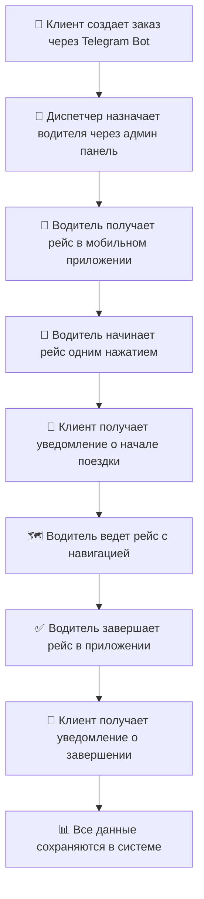

# 🚗 STC Transfer - Полная транспортная платформа

> **Профессиональная система управления транспортными услугами с Telegram интеграцией**

[](https://t.me/transfer_srs_bot)
[](https://reactjs.org/)
[](https://nodejs.org/)
[](https://www.typescriptlang.org/)
[](https://www.postgresql.org/)

## 🎯 О проекте

**STC Transfer** - это полноценная цифровая платформа для транспортных компаний, объединяющая:

- 🤖 **Telegram Bot для клиентов** (@transfer_srs_bot)
- 🚗 **Telegram Bot для водителей** (настраивается отдельно)
- 📱 **Telegram Web App** для водителей
- 🏢 **Админ панель** для диспетчеров
- 🔧 **API система** для интеграций

## ✨ Возможности

### 🚀 **Основные модули:**

| Модуль                           | Описание                                | Статус    |
| -------------------------------- | --------------------------------------- | --------- |
| 📋 **Управление заказами**       | Диспетчерская панель с полным контролем | ✅ Готово |
| 👤 **Управление водителями**     | Добавление, редактирование, назначение  | ✅ Готово |
| 🚙 **Управление транспортом**    | Автопарк с 5 типами автомобилей         | ✅ Готово |
| ⚙️ **Настройки системы**         | Гибкие тарифы и конфигурация            | ✅ Готово |
| 👥 **Управление пользователями** | Клиентская база с историей              | ✅ Готово |
| 📱 **Водительское приложение**   | Telegram Web App для рейсов             | ✅ Готово |

### 🔄 **Полный workflow:**



## 🚀 Быстрый старт

### 📱 Запуск Telegram Bot

**Telegram Bot уже настроен и готов к использованию!**

```bash
# Автоматический запуск (рекомендуется)
./start-telegram-bot.sh

# Или проверьте статус
./check-bot-status.sh
```

**Ваш бот:** [@transfer_srs_bot](https://t.me/transfer_srs_bot)

📖 **Подробное руководство:** [TELEGRAM_QUICK_START.md](TELEGRAM_QUICK_START.md)

### 📋 Требования

- Node.js 18+
- PostgreSQL 14+
- Telegram Bot Token (уже настроен)
- ngrok (для webhook)

### 🔧 Установка

```bash
# Клонирование репозитория
git clone https://github.com/farakor/stc-transfer.git
cd stc-transfer

# Установка зависимостей
npm install
cd backend && npm install
cd ../frontend && npm install

# Настройка базы данных
cd ../backend
cp .env.example .env
# Отредактируйте .env файл с вашими настройками

# Миграции базы данных
npx prisma migrate dev
npx prisma generate

# Запуск системы
cd ..
npm run dev
```

### 🌐 Доступные приложения

После запуска будут доступны:

- **📱 Водительское приложение:** http://localhost:3003/driver
- **🏠 Админ панель:** http://localhost:3003/admin/dashboard
- **👤 Клиентское приложение:** http://localhost:3003/vehicles
- **🔧 Тесты API:** http://localhost:3003/test-driver.html

## 📱 Telegram Web App для водителей

### ✨ Ключевые возможности:

- **🚀 Управление рейсами** - начать и завершить поездку одним нажатием
- **📍 Геолокация** - автоматическое определение местоположения
- **🗺️ Навигация** - интеграция с Яндекс.Картами
- **📞 Связь с клиентами** - прямые звонки из приложения
- **🔔 Уведомления** - автоматические сообщения клиентам
- **📊 Профиль водителя** - полная информация о статусе и автомобиле

### 🎯 Использование:

1. **Откройте приложение:** http://localhost:3003/driver
2. **Просмотрите новые рейсы** в списке
3. **Нажмите "Начать рейс"** для активного заказа
4. **Используйте навигацию** для построения маршрута
5. **Завершите рейс** по окончании поездки

## 🏢 Админ панель

### 📊 Модули управления:

#### **📋 Заказы**

- Просмотр всех активных заказов
- Назначение водителей
- Изменение статусов
- Отмена заказов
- Статистика и аналитика

#### **👤 Водители**

- Добавление новых водителей
- Редактирование профилей
- Назначение автомобилей
- Управление статусами
- История рейсов

#### **🚙 Транспорт**

- Управление автопарком
- 5 типов автомобилей (SEDAN, SUV, VAN, BUS, LUXURY)
- Индивидуальные тарифы
- Статусы доступности
- Интеграция с водителями

#### **⚙️ Настройки**

- Гибкие тарифы по типам транспорта
- Telegram Bot конфигурация
- Настройки уведомлений
- Экспорт/импорт настроек
- Системные параметры

#### **👥 Пользователи**

- Клиентская база данных
- История заказов
- Поиск и фильтрация
- Детальная аналитика
- Статистика активности

## 🔧 API Документация

### 🚗 **Водители**

```http
GET    /api/drivers/:id                    # Профиль водителя
GET    /api/drivers/:id/trips              # Рейсы водителя
GET    /api/drivers/telegram/:telegramId   # Поиск по Telegram ID
PUT    /api/drivers/:id/status             # Изменить статус
```

### 📋 **Заказы**

```http
GET    /api/bookings/active                # Активные заказы
PUT    /api/bookings/:id/start             # Начать рейс
PUT    /api/bookings/:id/complete          # Завершить рейс
PUT    /api/bookings/:id/assign-driver     # Назначить водителя
```

### 🚙 **Транспорт**

```http
GET    /api/vehicles/all                   # Все автомобили
POST   /api/vehicles                       # Создать автомобиль
PUT    /api/vehicles/:id                   # Обновить автомобиль
DELETE /api/vehicles/:id                   # Удалить автомобиль
```

### ⚙️ **Настройки**

```http
GET    /api/admin/settings                 # Все настройки
POST   /api/admin/settings                 # Сохранить настройки
GET    /api/admin/settings/categories      # Категории настроек
```

## 🏗️ Архитектура

### 📁 Структура проекта

```
stc-transfer/
├── backend/                 # Node.js + Express API
│   ├── src/
│   │   ├── controllers/     # Контроллеры API
│   │   ├── services/        # Бизнес-логика
│   │   ├── routes/          # API маршруты
│   │   └── utils/           # Утилиты
│   └── prisma/              # Схема базы данных
├── frontend/                # React + TypeScript
│   ├── src/
│   │   ├── pages/           # Страницы приложения
│   │   ├── components/      # React компоненты
│   │   ├── hooks/           # Custom hooks
│   │   └── services/        # API клиенты
│   └── public/              # Статические файлы
└── docs/                    # Документация
```

### 🗄️ База данных

**Основные модели:**

- `User` - клиенты системы
- `Driver` - водители
- `Vehicle` - автомобили
- `Booking` - заказы
- `Route` - маршруты
- `SystemSetting` - настройки системы

### 🔌 Интеграции

- **Telegram Bot API** - для клиентов и уведомлений
- **Telegram Web App** - для водителей
- **Яндекс.Карты** - для навигации
- **Prisma ORM** - для работы с базой данных

## 🧪 Тестирование

### 🔧 Тестовые страницы

- **Водительское приложение:** http://localhost:3003/test-driver.html
- **Настройки системы:** http://localhost:3003/test-settings.html
- **Управление пользователями:** http://localhost:3003/test-users.html
- **Управление транспортом:** http://localhost:3003/test-vehicles.html

### 📊 API тестирование

```bash
# Тест водительского API
curl http://localhost:3001/api/drivers/12

# Тест начала рейса
curl -X PUT -H "Content-Type: application/json" \
  -d '{"driverId": 12, "location": {"lat": 39.6547, "lng": 66.9597}}' \
  http://localhost:3001/api/bookings/:id/start

# Тест завершения рейса
curl -X PUT -H "Content-Type: application/json" \
  -d '{"driverId": 12, "location": {"lat": 41.2995, "lng": 69.2401}}' \
  http://localhost:3001/api/bookings/:id/complete
```

## 📚 Документация

### 📖 Подробные руководства:

#### 📱 Telegram Bots

**Клиентский бот (для пассажиров):**

- [🚀 Быстрый старт](TELEGRAM_QUICK_START.md) - Начните здесь!
- [📱 Полное руководство](TELEGRAM_CLIENT_GUIDE.md) - Детальная документация
- [⚙️ Конфигурация](TELEGRAM_CONFIG.md) - Настройка системы

**Водительский бот (для водителей):**

- [⚡ Быстрая настройка](DRIVER_BOT_QUICK.md) - Создание за 5 минут!
- [📖 Полное руководство](DRIVER_BOT_SETUP.md) - Детальная инструкция

#### 🚗 Другие модули

- [🚗 Водительское приложение](documentation/DRIVER_APP_FINAL.md)
- [⚙️ Система настроек](documentation/SETTINGS_SETUP.md)
- [👥 Управление пользователями](documentation/USERS_SETUP.md)
- [🚙 Управление транспортом](documentation/VEHICLES_SETUP.md)

### 🎯 Быстрые ссылки:

- **📱 Telegram Bot:** [@transfer_srs_bot](https://t.me/transfer_srs_bot)
- **🏠 Админ панель:** http://localhost:3003/admin/dashboard
- **🚗 Водительское приложение:** http://localhost:3003/driver
- **👤 Клиентское приложение:** http://localhost:3003/vehicles
- **🔧 API Backend:** http://localhost:3001
- **🌐 ngrok Dashboard:** http://localhost:4040 (когда запущен)

## 🚀 Развертывание

### 🌐 Продакшн

```bash
# Сборка frontend
cd frontend
npm run build

# Настройка backend
cd ../backend
npm run build
npm start
```

### 🐳 Docker (готовится)

```bash
docker-compose up -d
```

## 🤝 Вклад в проект

1. Fork репозитория
2. Создайте feature branch (`git checkout -b feature/amazing-feature`)
3. Commit изменения (`git commit -m 'Add amazing feature'`)
4. Push в branch (`git push origin feature/amazing-feature`)
5. Откройте Pull Request

## 📄 Лицензия

Этот проект лицензирован под MIT License - см. файл [LICENSE](LICENSE) для деталей.

## 📞 Поддержка

- **Email:** support@stc-transfer.com
- **Telegram:** @stc_support
- **Issues:** [GitHub Issues](https://github.com/farakor/stc-transfer/issues)

## 🎉 Благодарности

Спасибо всем участникам проекта за вклад в развитие транспортной платформы!

---

**STC Transfer** - Профессиональная транспортная платформа для современного бизнеса 🚗✨
